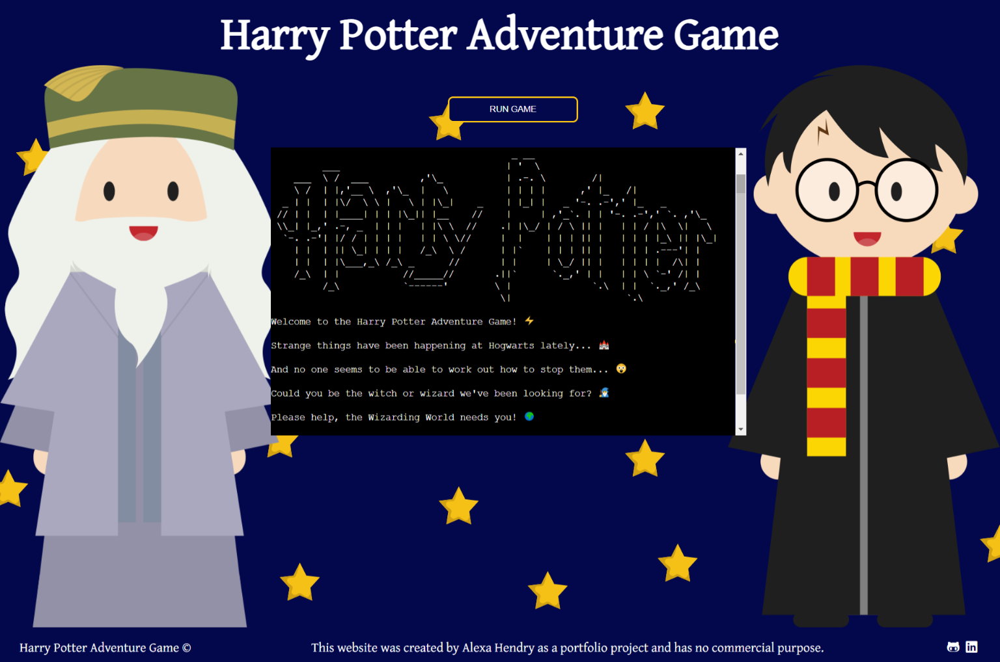
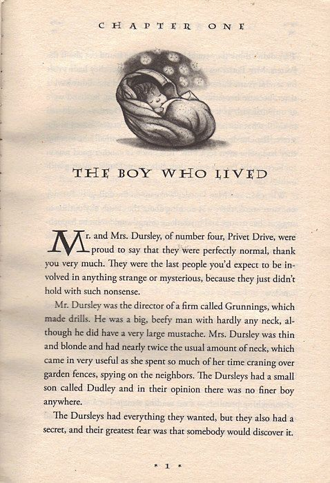
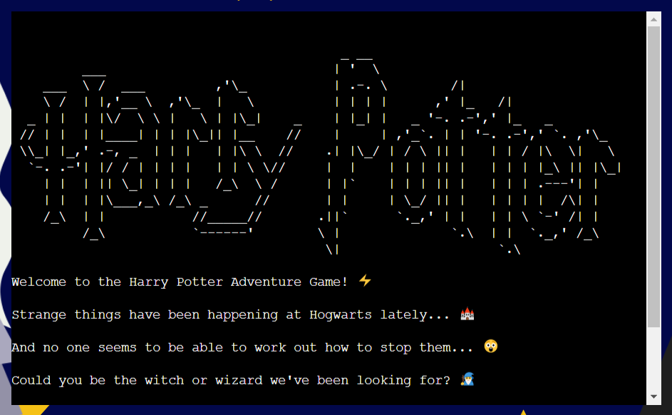
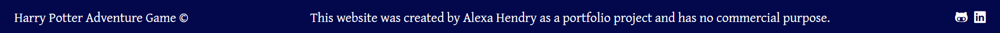

<h1 align="center">Harry Potter Adventure Game</h1>

The [Harry Potter Adventure Game](https://harry-potter-adventure-game.herokuapp.com/) has been developed for anyone interested in the world of Harry Potter, magic, and playing old-school text-based adventure games.

<h2 align="center"></h2>

## __User Experience (UX)__

-   ### ***User stories***

    -   #### First Time Visitor Goals

        1. As a First Time Visitor, I want to easily understand the main purpose of the site and have fun playing a virtual piano and/or a mini game.
        2. As a First Time Visitor, I want to be able to easily be able to navigate throughout the site to find content, including on how to use the virtual piano and play the game. 
        3. As a First Time Visitor, I want to locate the site creator's social media links to see their following on social media to determine how trusted and known they are.

    -   #### Returning Visitor Goals

        1. As a Returning Visitor, I want to use the sheet music to try and play along to well-known songs.
        2. As a Returning Visitor, I want to re-read the challenge instructions to try and beat the computer.
        3. As a Returning Visitor, I want to get in contact with the site creator with any questions I may have about the site.

    -   #### Frequent User Goals

        1. As a Frequent User, I want to attempt to play the sheet music songs using only the computer keyboard, without making any mistakes.
        2. As a Frequent User, I want to try and beat my personal best score on the challenge.
        3. As a Frequent User, I want to see if any new sheet music had been added.

-   ### ***Design***
    
    -   #### Colour Palette

        - The colour palette is made up of four colours: 
          - Blue #02084B
          - Yellow #F5C116
          - White #FFFFFF
          - Black #000000

        - The blue #02084B and yellow #F5C116 were chosen for their representation of magic and mystery, found in dark blue skies and yellow stars, and thus fitting with the theme of the site. They are also compatible with each other and complement each other through light and dark.

        - White #FFFFFF and black #000000 are used as the third and fourth colours on the site as neutral tones.

    -   #### Typography

        - The [Gentium Plus](https://fonts.google.com/specimen/Gentium+Plus?preview.text=The%20Boy%20who%20Lived&preview.text_type=custom) font is used across the site, in the header and footer specifically. 

        - It was chosen for it's similarity to the Harry Potter books' typeface:
        
    
    -   #### Imagery

        - The background image was added to render the site more visually appealing and to immediately convey the game's theme. 

        - The ASCII Harry Potter text art and the emojis used throughout the game were added to render the Command Line Interface more visual than the typical text-heavy options allow for.  

-   ### ***Wireframe***

    - A simple design was used to embellish the simplicity of the CLI, and create a more visually pleasing experience for the user. 

        

-   ### ***Flowchart***

    - A flowchart was produced to show how the game runs, including user interactions and data management.  

        

## __Features__

### ***Existing Features***

- #### Header

  

  - The header includes an h1 title "Harry Potter Adventure Game" to make it immediately clear to the user what the site is about.  
  
- #### Background Image

  

  - The background image provides an immediate visual cue to the user:
    - The characters of Harry Potter and Albus Dumbledore are instantly recognisable to fans of the books and films.
    - If the user isn't familiar with the franchise, they will still be able to recognise that the theme of the site is magic and wizardry.

- #### Button

  

  - The pre-existing button from the CI template was restyled to fit the theme of the page, and the words changed to "Run Game" to be more coherent regarding the activity of the page. 

- #### Terminal

  

  - The pre-existing terminal from the CI template was re-positioned to sit in the middle of the page and between the two characters in the background image.   

- #### Footer

  

  - The footer follows the same font style as the header and  contains three elements:
    - The copyrighted site name on the left hand side. 
    - Information about the site and how it was created. 
    - Social media links, allowing the user to visit the site creator's LinkedIn and GitHub pages. Hovering over the link icons turns them yellow to signal to the user that there is an interaction possible. All links are opened in separate tabs so that the user remains on the site. 

### ***Future Implementations***

- #### General

  - Improve Lighthouse SEO score on Play and Sheet Music pages.

  - Refactor and simplify JavaScript code, to make it easier to read and avoid any possible repetition. 

  - Improve accessibility across the site, including on audio files for the sheet music and the piano, the piano keys, and the sheet music. 

  - Include an alert to users on small devices that landscape mode is the preferred mode to play the piano on. 

- #### Navigation Bar

  - Make header invisible on smaller viewports and allow for swipe down or hover to make it appear.  

- #### Play Page

  - Include the option to play the piano with the keyboard on Challenge mode. 

  - Include a cursor pointer hover effect for the piano keys to make it clearer to the user that they are clickable.

  - Include a larger version of the virtual piano, with more notes, for very large screens.  

  - Include several versions of the Challenge to make it more interesting, such as the piano playing an actual, recognisable song, and hard and easy modes. 

  - Include audio sounds for correct and incorrect guesses on the Challenge, to further clarify what has occured to the user. 

- #### Sheet Music Page

  - Improve visuals on the iframes, such as colours fitting with the site. 

  - Find another option instead of the iframes altogether as they create bugs when loading and do not work on mobile devices. 

  - Include the sheet music on the Play page above the piano so that users can read and follow it more easily. Make it interactive also, scrolling down the page as you play, and highlighting the notes played on the screen.

- #### The Footer

  - Add a back to top arrow or button to allow the user to get back to the top of the screen easily. 

## __Technologies Used__

### ***Languages Used***
-   [Python](https://en.wikipedia.org/wiki/Python_(programming_language))

-   [HTML5](https://en.wikipedia.org/wiki/HTML5)

-   [CSS3](https://en.wikipedia.org/wiki/Cascading_Style_Sheets)

### ***Frameworks, Libraries & Programs Used***

1. [Git:](https://git-scm.com/)
    - Git was used for version control by utilizing the Gitpod terminal to commit to Git and Push to GitHub and Heroku.

1. [GitHub:](https://github.com/)
    - GitHub was used to store the projects code after being pushed from Git.

1. [Heroku:](https://heroku.com/)
    - Heroku was used for the deployed application.

1. [Canva:](https://www.canva.com/)
    - Canva was used to create the wireframes during the design process, and the background image of the site.

1. [Font Awesome Favicon Generator:](https://gauger.io/fonticon/)
    - Font Awesome Favicon Generator was used to produce the favicon version of the [Font Awesome Lightning Bolt Icon](https://fontawesome.com/icons/bolt-lightning?s=solid).

1. [Chrome DevTools:](https://developer.chrome.com/docs/devtools/):
    - Chrome DevTools was used to consistently check the site in terms of design output (html, css).

1. [Python Tutor:](https://pythontutor.com/)
    - Python Tutor was used to step through non-functioning code to find the problem and resolve it. 

1. [Lucidchart:](https://www.lucidchart.com/)
    - Lucidchart was used to create the flowchart at the design stage. 

## __Testing__

### ***Python, HTML and CSS Testing***

-   [PEP8 Online](http://pep8online.com/) was used to validate the project to ensure there were no Pyhton errors present.
    - [Results run.py](assets/testing/testing-py-run.png)
    - [Results gameplay.py](assets/testing/testing-py-gameplay.png)
    - [Results collectibles.py](assets/testing/testing-py-collectibles.png)
    - [Results questions.py](assets/testing/testing-py-questions.png)
    - [Results emojis.py](assets/testing/testing-py-emojis.png)

-   [W3C Markup Validator](https://jigsaw.w3.org/css-validator/) was used to validate the project to ensure there were no HTML syntax errors in the project.
    - [Results index.html](assets/testing/testing-html-index.pdf)
    - [Results sheet-music.html](assets/testing/testing-html-sheet-music.pdf)
    - [Results instructions.html](assets/testing/testing-html-instructions.pdf)

-   [W3C CSS Validator](https://jigsaw.w3.org/css-validator/) was used to validate the project to ensure there were no CSS syntax errors in the project.
    - [Results css](assets/testing/testing-css.png)

### ***Accessibility Testing***

  - [EightShapes Contrast Grid](http://eightshapes.com/) was used to test the colour palette of the site for any accessibility issues. Only AAA and AA rating options were used on the site. 
  
  
  - Any icons on the site that are for decorative purposes only use the aria-hidden="true" attribute to accommodate for accessibility, as recommended by [Font Awesome's Accessiblity Page](https://fontawesome.com/v5/docs/web/other-topics/accessibility)
    

### ***Testing User Stories from User Experience (UX) Section***

-   #### First Time Visitor Goals

    1. As a First Time Visitor, I want to easily understand the main purpose of the site and have fun playing a virtual piano and/or a mini game.

        1. Upon entering the site, users are automatically greeted with a clean and easily readable navigation bar to go to the page of their choice. Underneath, the user discovers the main content of the page.
        2. The main point of the site is made immediately clear with an invitation to choose your playing mode, seeing the as yet empty score board, and finally the virtual piano itself.  
        3. The user has the option to start playing immediately, by intuitively clicking on the Freestyle or Challenge button. If the rules of the challenge are not clear from playing, the user can easily navigate to the Instructions page to find out how to play.    

    2. As a First Time Visitor, I want to be able to easily be able to navigate throughout the site to find content, including on how to use the virtual piano and play the game.

        1. The site has been designed to be fluid and never to entrap the user. At the top of each page there is a clean navigation bar, each link clearly describes what page they will end up on. There is also a visual aid in the form of colours to help the user understand which page they are on: purple for the current page, black for the other pages they can click on to visit. 
        2. The navigation bar is in the fixed position and thus stays at the top of the page as the user navigates the site, allowing the user to easily switch between pages and get back to the top of the page again by clicking on the page link they are currently on. 
        3. On smaller viewports the navigation bar remains fixed, but is reduced in size as to not take up too much space, and includes the site name only, which remains clickable. In order to access the other site pages there is a hamburger bar to the right of the site name, which pops out below the site name and disappears again once the desired page has been selected. 
        4. The Instructions page greets the user with visual aids in the form of graphics, as well as clear headings, making it immediately clear what each section is about. A popup explains in detail what the challenge rules are, ensuring the user doesn't get frustrated trying to play the game. 

    3. As a First Time Visitor, I want to locate the site creator's social media links to see their following on social media to determine how trusted and known they are.

        1. The user can scroll to the bottom of any page on the site to locate social media links in the footer.

-   #### Returning Visitor Goals

    1. As a Returning Visitor, I want to use the sheet music to try and play along to well-known songs.

        1. The navigation bar clearly highlights the Sheet Music page.
        2. Each piece of sheet music includes a playable audio file of the song, allowing the user to familiarise themselves with the song if they do not know it. 
        3. The sheet music can be opened in a separate tab and used on a secondary computer screen to play along. It can also be downloaded, printed, and the zoom and page fit adjusted to enable a comfortable experience for the user. 

    2. As a Returning Visitor, I want to re-read the challenge instructions to try and beat the computer.

        1. The navigation bar clearly highlights the Instructions page.
        2. In the How to Play section, a hover effect turning the word 'here' purple and the cursor to a pointer make it clear to the user that this is a clickable element.   
        3. The popup detailing the rules of the challenge is clean, easy to read and explains thorougly how to play.  

    3. As a Returning Visitor, I want to get in contact with the site creator with any questions I may have about the site.

        1. The footer contains links to the site creator's GitHub and Linkedin pages.
        2. Whichever link they click, it will be opened up in a new tab to ensure the user can easily get back to the website.

-   #### Frequent User Goals

    1. As a Frequent User, I want to attempt to play the sheet music songs using only the computer keyboard, without making any mistakes.

        1. The user would already be comfortable with the website layout and could easily find the Play and Sheet Music pages in the navigation bar.
        2. The user would already be familiar with how to use the sheet music and listen to the corresponding audio. 
        3. The computer keyboard keys to be used are clearly indicated on the piano keys, thus facilitating their use. 

    2. As a Frequent User, I want to try and beat my personal best score on the challenge.

        1. The user would already be comfortable with the website layout and could easily find the Play Page in the navigation bar. 
        2. Having noted their previous results, the user would easily be able to keep track of the clear and self-explanatory score board. 

    3. As a Frequent User, I want to see if any new sheet music had been added.

        1. The user would already be comfortable with the website layout and could easily find the Sheet Music page in the navigation bar.
        2. Here they would quickly see if any new sheet music had been added to the list.  

### ***Further Testing***

-   The Website was tested on Google Chrome, Firefox, and Microsoft Edge browsers.

-   The website was viewed on a variety of devices such as Desktop up to 28 inch screen with 4k resolution, Laptop, Pixel 3a, Pixel 4, Samsung Galaxy Tab S5e.

-   A large amount of testing was done to ensure that all pages were linking correctly.

-   Friends and family members were asked to review the site and documentation to point out any bugs and/or user experience issues.

### ***Fixed Bugs***

- Initially `style.backgroundColor` was used on the Challenge mode of the piano to achieve a purple coloured piano key as it was played - see example `function twenty()` below. This was followed by a `clearKeyLights function`, resetting the `style.backgroundColor` to white and black respectively - see `function clearKeyLights` below. This however caused a bug when switching to Freestyle mode after having played Challenge mode: the purple colour no longer appeared when playing the notes. This was due to the `style.backgroundColor` taking precedence over the `.active` class used on Freestyle mode. The bug was fixed by applying an `.active` class on the Challenge as well - see `function nineteen()` example below. 
  - Key Colour Bug Add Colours:
  
    
  
  - Key Colour Bug Clear Colours:
  
    

### ***Known Bugs***

- The iframe containing the sheet music on the Sheet Music Page doesn't always load, requiring a hard refresh (ctrl + shift + R) - see example below. Chrome DevTools revealed the issue being that `<!DOCTYPE html>` hadn't been called and the site was therefore being loaded in Quirks Mode - see example below. However, `<!DOCTYPE html>` is present on all html pages, and this issue could therefore not be resolved. 
  
  - iframe Bug:
    
  
  - iframe Bug Quirks Mode:
    

- The iframe is also incompatible with most smaller devices as they are unable to display pdfs within the iframe. The user is required to open them in a separate viewer. Given that users are unlikely to play along to the sheet music on a mobile device this bug was accepted and noted for future improvements. 

- Occasionally the virtual piano has played several notes at once without explanation on the Challenge mode. This bug appears to be resolved but is noted nonetheless in case some users experience this.  

## __Deployment__

### ***Heroku***

The project was deployed using Code Institute's mock terminal for Heroku.

### ***Steps for deployment:***

1. Fork or clone this repository.
2. Create a new Heroku app.
3. Set the buildbacks to `python` and `NodeJS` in that order.
4. Link the Heroku app to the respository.
5. Click on Deploy.

## __Credits__

### ***Code***

- The following were used as references to help with writing the HTML, CSS and JavaScript code:
  - [Code Institute LMS](https://learn.codeinstitute.net/ci_program/diplomainsoftwaredevelopmentecommerce), in particular the [CI Love Maths Walkthrough](https://learn.codeinstitute.net/courses/course-v1:CodeInstitute+LM101+2021_T1/courseware/2d651bf3f23e48aeb9b9218871912b2e/78f3c10a937c4fe09640c7c0098d16bd/)
  - [W3Schools](https://www.w3schools.com/) 
  - [Stack Overflow](https://stackoverflow.com/)
  - [MDN Web Docs](https://developer.mozilla.org/en-US/)

- The virtual piano code was taken from [Web Dev Simplified's](https://www.youtube.com/channel/UCFbNIlppjAuEX4znoulh0Cw) [Build A Piano With JavaScript Tutorial](https://www.youtube.com/watch?v=vjco5yKZpU8) and adapted. 

- The game challenge code was taken from [Free Code Camp Org's](https://www.youtube.com/channel/UC8butISFwT-Wl7EV0hUK0BQ) [Simon Game JavaScript Tutorial for Beginners](https://www.youtube.com/watch?v=n_ec3eowFLQ) and adapted. 

- The CSS flexbox code was taken from [Stack Overflow](https://stackoverflow.com/), specifically from [this thread](https://stackoverflow.com/questions/643879/css-to-make-html-page-footer-stay-at-bottom-of-the-page-with-a-minimum-height-b).

- The code to use icons as list bullet points on the Instructions page was taken from [Font Awesome](https://fontawesome.com/), specifically [this page](https://fontawesome.com/docs/web/style/lists).

- The favicon code was taken from [W3Schools](https://www.w3schools.com/), specifically from [HTML Favicon](https://www.w3schools.com/html/html_favicon.asp) and adapted.

- The JavaScript media queries were taken from [CSS Tricks](https://css-tricks.com/), specifically [this article](https://css-tricks.com/working-with-javascript-media-queries/), and adapted. 

- The code for the hamburger menu on 800px width screens and smaller was taken from [W3 Schools](https://www.w3schools.com/), specifically [this section](https://www.w3schools.com/howto/tryit.asp?filename=tryhow_js_mobile_navbar), and adapted. 

- The code for the Simon game rules popup on the instructions page was taken from [W3 Schools](https://www.w3schools.com/), specifically [this aticle](https://www.w3schools.com/howto/tryit.asp?filename=tryhow_js_popup), and adapted. 

### ***Content***

- All text content was written by the site creator [Alexa Hendry](https://github.com/AlexaH88). 

### ***Media***

- The [piano graphic](https://www.canva.com/media/MAEYJcyVjO8) on the Instructions page was taken from graphic designer [vectortradition](https://www.canva.com/p/vectortradition/) via [Canva](https://www.canva.com/).

- The [mouse graphic](https://www.canva.com/media/MADHSKVmqUU) on the Instructions page was taken from graphic designer [BellafishPh](https://www.canva.cn/p/hnh-nh-ca-bellafish-ph/) via [Canva](https://www.canva.com/).

- The sheet music and corresponding audio on the Sheet Music page was taken from [Musescore](https://musescore.com/) with the individual songs credited as follows:
  - [The Entertainer - Scott Joplin](https://musescore.com/user/167019/scores/162108) by [rui.c.sousa.3](https://musescore.com/user/167019)
  - [Für Elise - Ludwig van Beethoven](https://musescore.com/user/19710/scores/33816) by [ClassicMan](https://musescore.com/classicman)
  - [Clair de Lune - Claude Debussy](https://musescore.com/user/19710/scores/58553) by [ClassicMan](https://musescore.com/classicman)
  - [Canon in D - Johann Pachelbel](https://musescore.com/user/1809056/scores/1019991) by [lemontart](https://musescore.com/user/1809056)
  - [Dance of the Sugar Plum Fairy - Pyotr Ilyich Tchaikovsky](https://musescore.com/user/3435661/scores/2899321) by [Nohpets](https://musescore.com/user/3435661)
  - [Greensleeves - Unknown Composer](https://musescore.com/user/35704259/scores/6340178) by [DominiqueMakowski](https://musescore.com/dominiquemakowski
  - [Happy Birthday - Patty & Mildred J. Hill](https://musescore.com/user/173585/scores/166951) by [wildpig](https://musescore.com/user/173585)

- The piano notes audio was recorded by the site creator [Alexa Hendry](https://github.com/AlexaH88) on [Ableton Live](https://www.ableton.com/en/live/) with the [Grand Piano](https://www.ableton.com/en/packs/grand-piano/) sound. 

### ***Acknowledgements***

Massive thanks to: 

- My mentor, [Darío Carrasquel](https://github.com/jeetkunecoder), for guiding me and giving me helpful feedback and advice. 

- My fellow Code Institute students and friends for their help, generous feedback, and incredible knowledge:
  - [Emanuel Silva](https://github.com/manni8436)
  - [Abi Harrison](https://github.com/Abibubble)
  - [Suzy Bennett](https://github.com/suzybee1987)
  - [Natalie Kate Alexander](https://github.com/natalie-kate)
  - [Dave Horrocks](https://github.com/DaveyJH)

- [David Bowers](https://www.linkedin.com/in/dnlbowers/) for inspiring me with his 3rd Portfolio Project: [Battleships](https://dnlbowers-battleship.herokuapp.com/) 

- Tutor Support, Student Care and the Slack Community at [Code Institute](https://codeinstitute.net/global/) for their support.

- And last but not least, my fiancé [Antoine Masson](https://www.linkedin.com/in/antoine-masson-55b65094/) for helping me through the stressful moments and for supporting us financially while I make this big career change. 