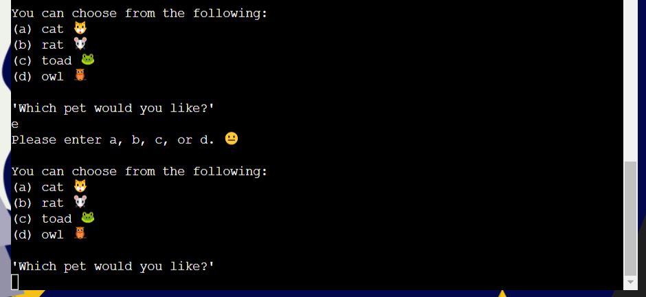

<h1 align="center">Harry Potter Adventure Game</h1>

The [Harry Potter Adventure Game](https://harry-potter-adventure-game.herokuapp.com/) has been developed for anyone interested in the world of Harry Potter, magic, and playing old-school text-based adventure games.

<h2 align="center"></h2>

## __How To Play__

The Hary Potter Adventure Game is a text-based adventure game, based on the Harry Potter books by J.K. Rowling. 

The storyline was written by the project's creator [Alexa Hendry](https://github.com/AlexaH88) and is played as follows, as outlined in the game instructions:

The user is prompted to enter a variety of inputs in order to complete the game, such as:
  - `y` or `n` on yes no (y/n) type questions.
  - `a`, `b`, `c`, or `d` on multiple choice (abcd) questions.
  - A free text field allowing for characters of their choice, for their name selection. 

Each input is validated by a response from the terminal, allowing the user to continue with the game if the response is correct, and to start over if the response is incorrect. 

## __User Experience (UX)__

-   ### ***User stories***

    -   #### First Time Visitor Goals

        1. As a First Time Visitor, I want to easily understand the main purpose of the site and have fun playing a text-based adventure game.
        2. As a First Time Visitor, I want to be able to easily navigate the terminal and understand the gameplay and purpose of the game. 
        3. As a First Time Visitor, I want to try out the game, and immerse myself in the world of Harry Potter.

    -   #### Returning Visitor Goals

        1. As a Returning Visitor, I want to attempt to play the game better than the first, by losing as few times as possible.
        2. As a Returning Visitor, I want to experience the game differently by choosing different inputs and seeing new outputs.
        3. As a Returning Visitor, I want to test my knowledge on all things Harry Potter.

    -   #### Frequent User Goals

        1. As a Frequent User, I want to attempt to play the game in its entirety without losing once.
        2. As a Frequent User, I want to change my experience by choosing a different name, pet, and hoping for a different wand.
        3. As a Frequent User, I want to see if any new storylines have been added.

-   ### ***Design***
    
    -   #### Colour Palette

        - The colour palette is made up of four colours: 
          - Blue #02084B
          - Yellow #F5C116
          - White #FFFFFF
          - Black #000000

        - The blue #02084B and yellow #F5C116 were chosen for their representation of magic and mystery, found in dark blue skies and yellow stars, and thus fitting with the theme of the site. They are also compatible with each other and complement each other through light and dark.

        - White #FFFFFF and black #000000 are used as the third and fourth colours on the site as neutral tones.

    -   #### Typography

        - The [Gentium Plus](https://fonts.google.com/specimen/Gentium+Plus?preview.text=The%20Boy%20who%20Lived&preview.text_type=custom) font is used across the site, in the header and footer specifically. 

        - It was chosen for it's similarity to the Harry Potter books' typeface:
        
    
    -   #### Imagery

        - The background image was added to render the site more visually appealing and to immediately convey the game's theme. 

        - The ASCII Harry Potter text art and the emojis used throughout the game were added to render the Command Line Interface more visual than the typical text-heavy options allow for.  

-   ### ***Wireframe***

    - A simple design was used to embellish the simplicity of the CLI, and create a more visually pleasing experience for the user. 

        

-   ### ***Flowchart***

    - A flowchart was produced to show how the game runs, including user interactions and data management.  

        

## __Features__

### ***Existing Features***

- #### Header

  

  - The header includes an h1 title "Harry Potter Adventure Game" to make it immediately clear to the user what the site is about.  

- #### Background Image

  

  - The background image provides an immediate visual cue to the user:
    - The characters of Harry Potter and Albus Dumbledore are instantly recognisable to fans of the books and films.
    - If the user isn't familiar with the franchise, they will still be able to recognise that the theme of the site is magic and wizardry.

- #### Button

  

  - The pre-existing button from the CI template was restyled to fit the theme of the page, and the words changed to "Run Game" to be more coherent regarding the activity of the page. 

- #### Terminal

  

  - The pre-existing terminal from the CI template was re-positioned to sit in the middle of the page and between the two characters in the background image.

- #### Welcome Screen

  

  - The game begins with a welcome screen, showing ASCII art and introducing the game synopsis. 

- #### Play Game Question

  - The first y/n question the user is asked is whether they would like to play the game or not. This allows for good UX from the beginning, making it the user's choice whether they would like to engage or not. 
  

- #### Game Instructions

  - The second y/n question the user is asked is whether they would like to read the game instructions or not. The user is free to decide whether they require more information in order to play the game or not. Some users prefer an intuitive approach, whereas others prefer guidance before diving in.
  

- #### Player Name

  - The third input is a free field that can take any inputs, and prompts the user to choose a player name. This was added to make the game more personalised and engage the user further. 
  

- #### Wand

  - The next part of the game is about the user acquiring a wand in order to beat the enemy in the game. This entails a backstory and question to be answered, providing embellishment to the story and user interaction so as to keep the user entertained.  
  
  

- #### Pet

  - The next part of the game is about the user acquiring a pet in order to advance in the game. This entails a backstory and question to be answered, providing embellishment to the story and user interaction so as to keep the user entertained.  
  
  

- #### Hogwarts

  - The next part of the game is about the user travelling to Hogwarts to start the quest. This entails a backstory, providing embellishment to the story.  
  

- #### First Room

  - The next part of the game is about the user gaining access to the first room and solving the puzzles inside. This entails a backstory and question on the first key, first room and first item.   
  
  
  
  

- #### Second Room

  - The next part of the game is about the user gaining access to the second room and solving the puzzles inside. This entails a backstory and question on the second key, second room and second item.   
  
  
  
  

- #### Third Room

  - The next part of the game is about the user gaining access to the third room and solving the puzzles inside. This entails a backstory and question on the third key, third room and third item.   
  
  
  
  

- #### Fourth Room

  - The final part of the game is about the user gaining access to the fourth and final room and beating the enemy inside. This entails a backstory and question on the fourth key, fourth room and two spell questions to beat the boss.   
  
  
  
  
  

- #### Win Game

  - If the user manages to beat the boss, the win game function will run, giving the user a well-earned virtual pat on the back!   
  

- #### Game Over

  - If the user answers any questions incorrectly along the way, the game over function will run and the player will have to start over!   
  

- #### Emojis
  - Emojis are used throughout the game to make it more visual than just the plain text, and to add to the video game theme of the site.

- #### Footer

  

  - The footer follows the same font style as the header and  contains three elements:
    - The copyrighted site name on the left hand side. 
    - Information about the site and how it was created. 
    - Social media links, allowing the user to visit the site creator's LinkedIn and GitHub pages. Hovering over the link icons turns them yellow to signal to the user that there is an interaction possible. All links are opened in separate tabs so that the user remains on the site. 

### ***Future Implementations***

- #### General

  - Refactor and simplify Python code, to make it easier to read and avoid any possible repetition. 

  - Allow for the user to slow down or speed up text speed, or choose not to have slowprint at all. 

  - Have the option to run the game in other languages to make it more accessible to non English-speakers. 

  - Have the option to run the game with audio reading out the text, to make it more accessible. 

- #### Game Instructions

  - Add any new game instructions as and when the game is developed further. 

- #### Player Name

  - Add the possibility of re-using the player name throughout the game, in a global variable. Allowing for a more personalised UX. 

- #### Wand

  - Add more wand options from more characters in the books. 

  - Or create personalised wand choices instead, consisting of a random assortment of wand "ingredients" (wood, core, size, characteristic), rather than wands that already belong to other characters. 

- #### Pet

  - Create more interaction with the chosen pet, allowing for a stronger connection with and use of the animals in the game. 

- #### Hogwarts

  - Add more description of Hogwarts and the surroundings in general to immerse the user eve more into the story. 

- #### Rooms and Items

  - Create a more complex room structure, with the possibility of choosing several doors in each room. Add additional items to be collected, each allowing access to a specific door that the player needs to figure out. 

  - Enable viewing of the player's inventory at any time to allow the user to see what they have collected, helping them to figure out which item can open which door. 

- #### Game Over

  - Allow for the player to exit the game at any time, enabling better UX. 

- #### House Selection and Scoreboard

  - Add Hogwarts House selection at the beginning of the game, randomly selected by the sorting hat. 

  - According to the House you are sorted into, the House ghost will guide you through the game - instead of the generic narration that currently exists. 

  - Allow for two attempts at the questions, and award House points if:
    - Correct answer on the first try: 10 points
    - Correct answer on the second try: 5 points

  - Store the House points in a Google Sheets document, viewable by the player at any point during the game. The House with the highest score is the leader for the House Cup. 

## __Technologies Used__

### ***Languages Used***
-   [Python](https://en.wikipedia.org/wiki/Python_(programming_language))

-   [HTML5](https://en.wikipedia.org/wiki/HTML5)

-   [CSS3](https://en.wikipedia.org/wiki/Cascading_Style_Sheets)

### ***Frameworks, Libraries & Programs Used***

1. [Git:](https://git-scm.com/)
    - Git was used for version control by utilizing the Gitpod terminal to commit to Git and Push to GitHub and Heroku.

1. [GitHub:](https://github.com/)
    - GitHub was used to store the projects code after being pushed from Git.

1. [Heroku:](https://heroku.com/)
    - Heroku was used for the deployed application.

1. [Canva:](https://www.canva.com/)
    - Canva was used to create the wireframes during the design process, and the background image of the site.

1. [Font Awesome](https://fontawesome.com/):
    - Font Awesome was used on the footer of the site to add icons for the social media links, for aesthetic and UX purposes.

1. [Font Awesome Favicon Generator:](https://gauger.io/fonticon/)
    - Font Awesome Favicon Generator was used to produce the favicon version of the [Font Awesome Lightning Bolt Icon](https://fontawesome.com/icons/bolt-lightning?s=solid).

1. [Chrome DevTools:](https://developer.chrome.com/docs/devtools/):
    - Chrome DevTools was used to consistently check the site in terms of design output (html, css).

1. [Python Tutor:](https://pythontutor.com/)
    - Python Tutor was used to step through non-functioning code to find the problem and resolve it. 

1. [Lucidchart:](https://www.lucidchart.com/)
    - Lucidchart was used to create the flowchart at the design stage. 

1. [random:](https://docs.python.org/3/library/random.html)
    - The random library was used in order to randomly assign a wand out of a choice of 3 options, on the `assign_wand()` function.

1. [sys:](https://docs.python.org/3/library/sys.html)
    - The sys library was used:
      - in order to exit the system, on the `exit_game()` function.
      - to alter the print functionality on the `slowprint()` function.

1. [time:](https://docs.python.org/3/library/time.html)
    - The time library was used to adjust the print speed on the `slowprint()` function.

## __Data Model__

### ***Classes***

  - Classes are used on question types, allowing the personalisation of responses, including emoji choices. 

  - Classes are also used on the wands and pets in the game, storing three and four options respectively that can be called. 

### ***Functions***

  - Functions are used on question types to avoid repetitive code and refactor as much as possible. 

  - Functions are also used on repeating sequences, such as the player collecting a key, with `key_main()`

  - Functions are also used to add collected items to the inventory, which is used predominantly on the `first_key_challenge()` to discern whether the player's chosen pet is capable of overcoming the selected obstacle and collect the key. This would be used further in future implementations, as described above.

### ***Methods***

  - Methods are used througout the game to print or return responses to user inputs and the user's advancement in the game. 

## __Testing__

### ***Python, HTML and CSS Testing***

-   [PEP8 Online](http://pep8online.com/) was used to validate the project to ensure there were no Python errors present.
    - Results run.py:
    
    - Results gameplay.py:
    
    - Results collectibles.py:
    
    - Results questions.py:
    
    - Results emojis.py:
    

-   [W3C Markup Validator](https://jigsaw.w3.org/css-validator/) was used to validate the project to ensure there were no HTML syntax errors present.
    - Results index.html:
    
    - Results layout.html:
    

-   [W3C CSS Validator](https://jigsaw.w3.org/css-validator/) was used to validate the project to ensure there were no CSS syntax errors present.
    - Results css:
    

### ***Accessibility Testing***

  - [EightShapes Contrast Grid](https://contrast-grid.eightshapes.com/) was used to test the colour palette of the site for any accessibility issues. Only AAA and AA rating options were used on the site. 
  

### ***Testing User Stories from User Experience (UX) Section***

-   #### First Time Visitor Goals

    1. As a First Time Visitor, I want to easily understand the main purpose of the site and have fun playing a text-based adventure game.

        1. Upon entering the site, users are immediately greeted with a clean and easily readable site, with a minimalistic design.
        2. The main point of the site is made immediately clear with a big self-explanatory heading, graphic icons of Harry Potter and Albus Dumbledore, and the welcome screen of the terminal that introduces the game. 
        3. The user has the option to start playing immediately, by inputting `y` on the terminal on the first question. 

    2. As a First Time Visitor, I want to be able to easily navigate the terminal and understand the gameplay and purpose of the game.

        1. The second question in the game allows the user to see the game instructions, helping them to understand how the game is played. 
        2. The game runs at a comfortable speed for the user to follow, thus as not to overwhelm the user with too much information at once, and giving them time to think about their answers.  
        3. The user can get out of the game at any time by clicking on the 'Run Game' button at the top of the screen and start again from the beginning. 

    3. As a First Time Visitor, I want to try out the game, and immerse myself in the world of Harry Potter.

        1. The user is immediately pulled into the world of Harry Potter, both with the design of the site and the storyline which recalls the familiar characters and features of the books. 
        2. As a Harry Potter fan, the user won't find it too difficult to play the game and get the answers correct. 

-   #### Returning Visitor Goals

    1. As a Returning Visitor, I want to use the sheet music to try and play along to well-known songs.

        1. The navigation bar clearly highlights the Sheet Music page.
        2. Each piece of sheet music includes a playable audio file of the song, allowing the user to familiarise themselves with the song if they do not know it. 
        3. The sheet music can be opened in a separate tab and used on a secondary computer screen to play along. It can also be downloaded, printed, and the zoom and page fit adjusted to enable a comfortable experience for the user. 

    2. As a Returning Visitor, I want to re-read the challenge instructions to try and beat the computer.

        1. The navigation bar clearly highlights the Instructions page.
        2. In the How to Play section, a hover effect turning the word 'here' purple and the cursor to a pointer make it clear to the user that this is a clickable element.   
        3. The popup detailing the rules of the challenge is clean, easy to read and explains thorougly how to play.  

    3. As a Returning Visitor, I want to get in contact with the site creator with any questions I may have about the site.

        1. The footer contains links to the site creator's GitHub and Linkedin pages.
        2. Whichever link they click, it will be opened up in a new tab to ensure the user can easily get back to the website.

-   #### Frequent User Goals

    1. As a Frequent User, I want to attempt to play the sheet music songs using only the computer keyboard, without making any mistakes.

        1. The user would already be comfortable with the website layout and could easily find the Play and Sheet Music pages in the navigation bar.
        2. The user would already be familiar with how to use the sheet music and listen to the corresponding audio. 
        3. The computer keyboard keys to be used are clearly indicated on the piano keys, thus facilitating their use. 

    2. As a Frequent User, I want to try and beat my personal best score on the challenge.

        1. The user would already be comfortable with the website layout and could easily find the Play Page in the navigation bar. 
        2. Having noted their previous results, the user would easily be able to keep track of the clear and self-explanatory score board. 

    3. As a Frequent User, I want to see if any new sheet music had been added.

        1. The user would already be comfortable with the website layout and could easily find the Sheet Music page in the navigation bar.
        2. Here they would quickly see if any new sheet music had been added to the list.  

### ***Manual Testing***

- The game was tested extensively, with particular attention being paid to input validation and error checking to ensure the user always received appropriate feedback.

  1. Yes / No Inputs:
      - Yes Responses:
      
      - No Responses:
      
      - Other Responses:
      

  2. Abcd Inputs:
      - Correct Responses:
      
      - Incorrect Responses:
      
      - Other Responses:
      

### ***Further Testing***

-   The site was tested on Google Chrome, Firefox, Safari and Microsoft Edge browsers.

-   A large amount of testing was done to ensure that all user inputs were validated and returned a response.

-   Friends and family members were asked to review the site and game to point out any bugs and/or user experience issues.

### ***Fixed Bugs***

- Initially the background image was not showing due to the file path not being recognised in `assets/images/background-image.png`. A fix was found thanks to a search on the Slack Community and [Dave Horrocks'](https://github.com/DaveyJH) great advice to another student. This sparked the idea to use a link to imgur instead. 
 

### ***Known Bugs***

- The emojis in the game don't always render properly for Mac and Firefox users. No solution was found to fix this. 
  - Firefox Bug:

  - Mac Bug:

- Users are able to input while the game text is running, causing the input key to be taken into account on the upcoming question, and potentially causing a Game Over. This is not great UX and will be improved upon in a future update of the project. 
  - User Input Bug:

## __Deployment__

### ***Heroku***

The project was deployed using Code Institute's mock terminal for Heroku.

### ***Steps for deployment:***

1. Fork or clone this repository.
2. Create a new Heroku app.
3. Set the buildbacks to `python` and `NodeJS` in that order.
4. Link the Heroku app to the respository.
5. Click on Deploy.

## __Credits__

### ***Code***

- The following were used as references to help with writing the HTML, CSS and Python code:
  - [Code Institute LMS](https://learn.codeinstitute.net/ci_program/diplomainsoftwaredevelopmentecommerce), in particular the [Love Sandwiches Walkthrough Project](https://learn.codeinstitute.net/courses/course-v1:CodeInstitute+LS101+2021_T1/courseware/293ee9d8ff3542d3b877137ed81b9a5b/58d3e90f9a2043908c62f31e51c15deb/)
  - [W3Schools](https://www.w3schools.com/) 
  - [Stack Overflow](https://stackoverflow.com/)
  - [MDN Web Docs](https://developer.mozilla.org/en-US/)
  - [Geeks for Geeks](https://www.geeksforgeeks.org/)
  - [Delft Stack](https://www.delftstack.com/)

- The slowprint code was taken from [Code Grepper](https://www.codegrepper.com/), in particular from [this thread](https://www.codegrepper.com/code-examples/python/python+slow+print) posted by [Robin R](https://www.codegrepper.com/profile/robin). 

- The emoji unicodes were taken from [Unicode Plus](https://unicodeplus.com/).

- The ASCII art at the beginning of the game was taken from [TextArt.io](https://textart.io/), specifically from [this thread](https://textart.io/art/TDZHnZH_mLKO1bHKCpKP9QeF/harry-potter-and-the-chamber-of-secrets) by an uncredited artist, and adapted. 

- The code to center the button and terminal elements on the page was taken from [Stack Overflow](https://stackoverflow.com/), specifically [this thread](https://stackoverflow.com/questions/8508275/how-to-center-a-position-absolute-element)

- The CSS flexbox code was taken from [Stack Overflow](https://stackoverflow.com/), specifically from [this thread](https://stackoverflow.com/questions/643879/css-to-make-html-page-footer-stay-at-bottom-of-the-page-with-a-minimum-height-b).

- The favicon code was taken from [W3Schools](https://www.w3schools.com/), specifically from [HTML Favicon](https://www.w3schools.com/html/html_favicon.asp) and adapted.

### ***Content***

- All game text content was written by the site creator [Alexa Hendry](https://github.com/AlexaH88), but is obviously based on [J.K. Rowling's](https://en.wikipedia.org/wiki/J._K._Rowling) [Harry Potter](https://en.wikipedia.org/wiki/Harry_Potter) books. 

- The following sites were used as references to write the game story:
  - [Wizarding World](https://www.wizardingworld.com/)
  - [Harry Potter Fandom](https://harrypotter.fandom.com/wiki/Main_Page)

### ***Media***

- The [Harry Potter](https://www.canva.com/photos/MAEzYWkXDIw-harry-potter/) and [Albus Dumbledore](https://www.canva.com/photos/MAE4nVVdqR8-harry-potter/) graphics on the background image were taken from graphic designer [Iqzaulia Project](https://www.canva.com/p/gambar-iqzaulia/) via [Canva](https://www.canva.com/).

- The [yellow star](https://www.canva.com/icons/MAC2qaSI20A-star/) graphic on the background image was taken from graphic designer [djvstock](https://www.canva.com/p/djvstock/) via [Canva](https://www.canva.com/). 

- The background image was put together by the site creator [Alexa Hendry](https://github.com/AlexaH88) using [Canva](https://www.canva.com/).

### ***Acknowledgements***

Massive thanks to: 

- My mentor, [Darío Carrasquel](https://github.com/jeetkunecoder), for guiding me and giving me helpful feedback and advice. 

- My fellow Code Institute students and friends for their help, generous feedback, and incredible knowledge:
  - [Emanuel Silva](https://github.com/manni8436)
  - [Abi Harrison](https://github.com/Abibubble)
  - [Suzy Bennett](https://github.com/suzybee1987)
  - [Natalie Kate Alexander](https://github.com/natalie-kate)
  - [Dave Horrocks](https://github.com/DaveyJH)

- [David Bowers](https://www.linkedin.com/in/dnlbowers/) for inspiring me with his 3rd Portfolio Project: [Battleships](https://dnlbowers-battleship.herokuapp.com/) 

- [Dave Horrocks](https://github.com/DaveyJH) for inspiring me with his 3rd Portfolio Project: [Computer Literate Investigator](https://computer-literate-investigator.herokuapp.com/)

- Tutor Support, Student Care and the Slack Community at [Code Institute](https://codeinstitute.net/global/) for their support.

- And last but not least, my fiancé [Antoine Masson](https://www.linkedin.com/in/antoine-masson-55b65094/) for helping me through the stressful moments and for supporting us financially while I make this big career change. 